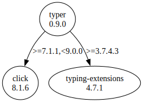

# Third Party Dependencies

<!--[[[fill sbom_sha256()]]]-->
The [SBOM in CycloneDX v1.4 JSON format](https://git.sr.ht/~sthagen/omforme/blob/default/sbom/cdx.json) with SHA256 checksum ([403b5293 ...](https://git.sr.ht/~sthagen/omforme/blob/default/sbom/cdx.json.sha256 "sha256:403b5293e7b366cd3a8a59f3022a76c8cd281d6ab55ee24d4eb26b79917f708d")).
<!--[[[end]]] (checksum: f15f4e73584fb695f91a886d19837f72)-->
## Licenses 

JSON files with complete license info of: [direct dependencies](direct-dependency-licenses.json) | [all dependencies](all-dependency-licenses.json)

### Direct Dependencies

<!--[[[fill direct_dependencies_table()]]]-->
| Name                                       | Version                                        | License     | Author            | Description (from packaging data)                                  |
|:-------------------------------------------|:-----------------------------------------------|:------------|:------------------|:-------------------------------------------------------------------|
| [typer](https://github.com/tiangolo/typer) | [0.9.0](https://pypi.org/project/typer/0.9.0/) | MIT License | Sebastián Ramírez | Typer, build great CLIs. Easy to code. Based on Python type hints. |
<!--[[[end]]] (checksum: 80e791c1fdef7665f4104495541de7b1)-->

### Indirect Dependencies

<!--[[[fill indirect_dependencies_table()]]]-->
| Name                                                             | Version                                                    | License                            | Author                                                                                | Description (from packaging data)                      |
|:-----------------------------------------------------------------|:-----------------------------------------------------------|:-----------------------------------|:--------------------------------------------------------------------------------------|:-------------------------------------------------------|
| [click](https://palletsprojects.com/p/click/)                    | [8.1.3](https://pypi.org/project/click/8.1.3/)             | BSD License                        | Armin Ronacher                                                                        | Composable command line interface toolkit              |
| [typing_extensions](https://github.com/python/typing_extensions) | [4.4.0](https://pypi.org/project/typing_extensions/4.4.0/) | Python Software Foundation License | "Guido van Rossum, Jukka Lehtosalo, Łukasz Langa, Michael Lee" <levkivskyi@gmail.com> | Backported and Experimental Type Hints for Python 3.7+ |
<!--[[[end]]] (checksum: ce9eb9e0a6f0193879b25757445a6732)-->

## Dependency Tree(s)

JSON file with the complete package dependency tree info of: [the full dependency tree](package-dependency-tree.json)

### Rendered SVG

Base graphviz file in dot format: [Trees of the direct dependencies](package-dependency-tree.dot.txt)



### Console Representation

<!--[[[fill dependency_tree_console_text()]]]-->
````console
typer==0.9.0
├── click [required: >=7.1.1,<9.0.0, installed: 8.1.3]
└── typing-extensions [required: >=3.7.4.3, installed: 4.4.0]
````
<!--[[[end]]] (checksum: ca215eb24926e0be2bc9d69e4e1d0d8b)-->
